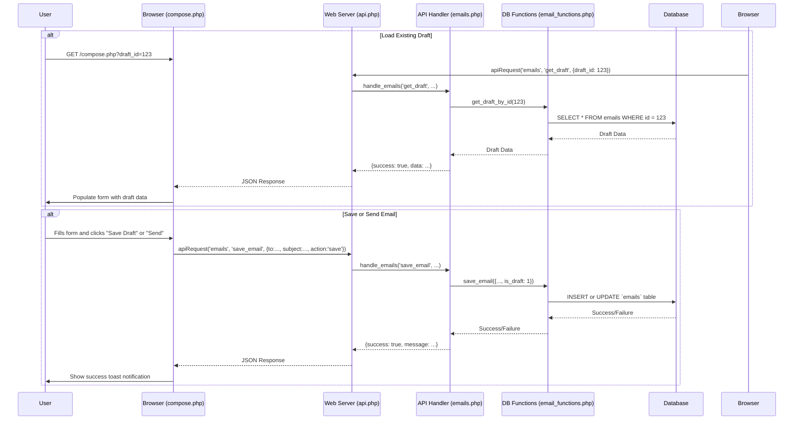

# Plan to Create `compose.php`

This document outlines the plan to create the `compose.php` script and its supporting backend functionality. The plan is divided into two main phases: enhancing the backend API and then creating the frontend script.

## Phase 1: Backend API Enhancements

This phase focuses on extending the backend API to support creating, updating, and fetching email drafts. This involves modifying `email_functions.php` to add the database logic and `emails.php` to expose this logic via new API actions.

1.  **Update `public/api_handlers/email_functions.php`:**

    - Create a new function, `get_draft_by_id($db, $draft_id, $user_id)`, to securely fetch a single email draft from the `emails` table, ensuring the draft belongs to the current user.
    - Create another new function, `save_email($db, $data)`, which will handle both `INSERT` operations for new emails and `UPDATE` operations for existing drafts. This function will use prepared statements to prevent SQL injection and will determine whether to insert or update based on the presence of a `draft_id` in the provided data.

2.  **Update `public/api_handlers/emails.php`:**
    - Add a new `case 'get_draft':` to the main `switch` statement. This new case will handle requests to fetch an existing draft by calling the `get_draft_by_id` function and returning the data as a JSON response.
    - Add a `case 'save_email':` to the `switch` statement. This will process the form submission, calling the `save_email` function. It will intelligently handle both "Send" and "Save Draft" actions by inspecting the `action` value from the input and setting the `is_draft` database flag accordingly (`0` for send, `1` for save).

## Phase 2: Frontend Script Creation (`compose.php`)

With the backend ready, the `public/emailapp/compose.php` file will be created, containing the user interface and the client-side logic for interaction.

1.  **Create `public/emailapp/compose.php`:**
    - **PHP Controller Logic:** At the top of the file, include session handling and the site header. Check for a `draft_id` in the URL's query string (`$_GET`). If a `draft_id` is present, pass it to the JavaScript part of the page to trigger the loading of the draft.
    - **HTML View:** Render a clean HTML5 form with fields for the recipient's email, subject, and a textarea for the body. A hidden input field will hold the `draft_id` when editing. The form will feature two distinct submit buttons: one for "Send Email" (`value="send"`) and one for "Save Draft" (`value="save"`).
    - **JavaScript Client-side Logic:**
      - **Draft Loading:** On page load, the script will check for a `draft_id`. If one exists, it will use the global `apiRequest` function to call the new `get_draft` API endpoint and populate the form fields with the fetched data.
      - **Form Submission:** Attach a `submit` event listener to the form. This listener will prevent the default submission, gather all form data, identify which button was clicked ("Send" or "Save"), and then use `apiRequest` to send the data to the `save_email` endpoint. Upon a successful response, it will provide clear user feedback using a toast notification.

## Execution Flow Diagram

The following diagram illustrates the interaction between the components:

