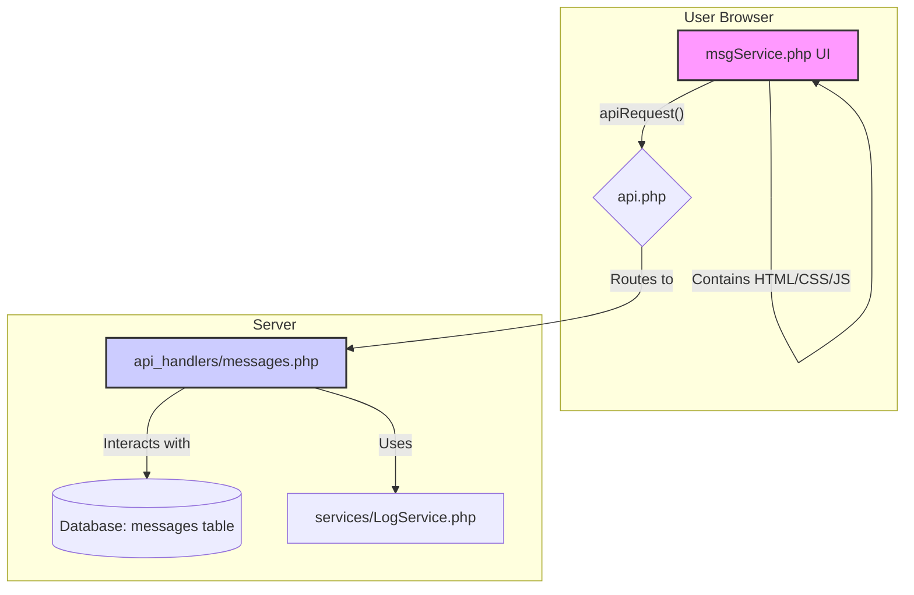

# Plan for System-Wide Messaging Service

This plan outlines the technical implementation for a new system-wide messaging service.

## 1. Database Schema

A new migration file will be created to add the `messages` table.

**Migration File:** `db/migrations/create_messages_table.sql`

```sql
CREATE TABLE `messages` (
  `id` INT AUTO_INCREMENT PRIMARY KEY,
  `sender_id` INT NOT NULL,
  `receiver_id` INT,
  `related_table` VARCHAR(255) NOT NULL,
  `related_id` INT NOT NULL,
  `message` TEXT NOT NULL,
  `timestamp` DATETIME NOT NULL DEFAULT CURRENT_TIMESTAMP,
  `is_read` TINYINT(1) NOT NULL DEFAULT 0,
  FOREIGN KEY (`sender_id`) REFERENCES `users`(`id`) ON DELETE CASCADE,
  FOREIGN KEY (`receiver_id`) REFERENCES `users`(`id`) ON DELETE SET NULL
);
```

## 2. Backend Implementation

### A. API Handler: `public/api_handlers/messages.php`

This file will contain the core logic for all message-related actions.

```php
<?php
// File: public/api_handlers/messages.php

require_once __DIR__ . '/../includes/db.php';
require_once __DIR__ . '/../services/LogService.php';

function handle_messages($action, $method, $db, $input) {
    $logService = new LogService();

    switch ($action) {
        case 'create':
            // Logic to create a new message
            break;

        case 'list':
            // Logic to list messages for the logged-in user
            break;

        case 'mark-read':
            // Logic to mark a specific message as read
            break;

        case 'by-entity':
            // Logic to get all messages related to a specific entity
            break;

        default:
            return ['success' => false, 'message' => 'Unknown action'];
    }
}
```

### B. Frontend Service Page: `public/services/msgService.php`

This file will be the user-facing page for viewing and interacting with messages. It will contain HTML, CSS, and JavaScript.

- **UI Features:** Filterable list, search, read/unread indicators.
- **JavaScript Logic:** Use `apiRequest` to communicate with the API handler.

## 3. System Architecture Diagram


